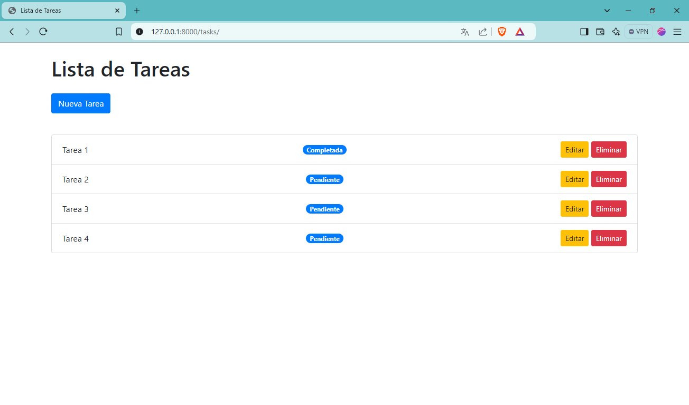
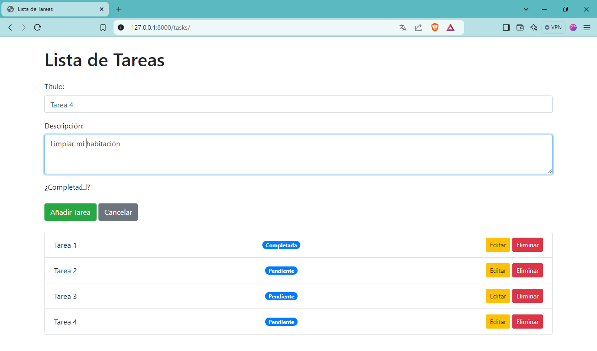
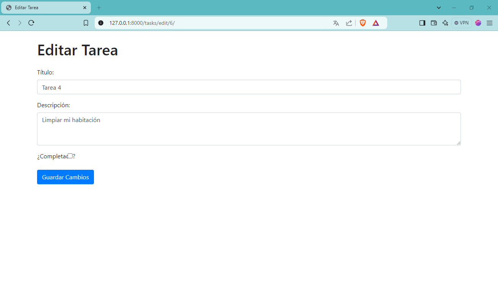
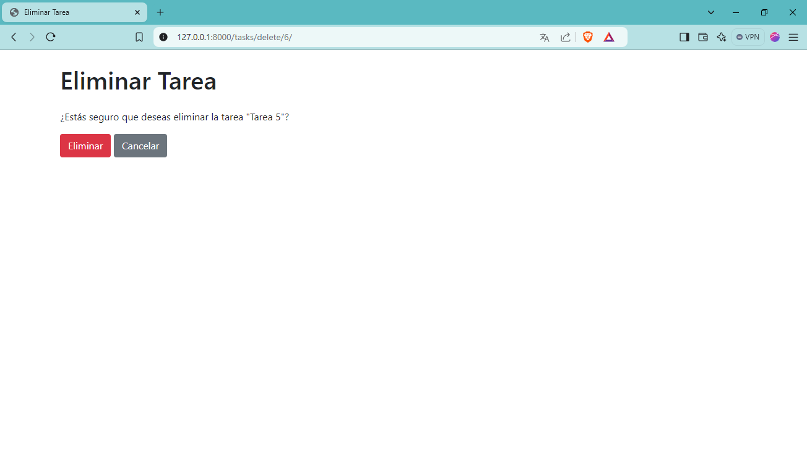

# Task Manager

## Descripción

Task Manager es una aplicación web desarrollada en Django que permite a los usuarios gestionar tareas de manera sencilla. Los usuarios pueden crear, editar y eliminar tareas, así como marcar tareas como completadas.

## Herramientas utilizadas

- **Django**: Framework de desarrollo web en Python.
- **SQL Server**: Sistema de gestión de bases de datos utilizado para almacenar las tareas.
- **ODBC Driver 17**: Controlador para conectar Django con SQL Server.
- **Bootstrap**: Framework CSS utilizado para mejorar la apariencia de la aplicación.
- **Python**: Lenguaje de programación utilizado en el desarrollo del proyecto.

## Requisitos

- Python 3.x
- Django
- pyodbc

## Instalación y configuración

1. **Clona el repositorio**:

   ```bash
   git clone <URL_DEL_REPOSITORIO>
   cd taskmanager
2. **Crea un entorno virtual y actívalo:**

    ```bash
    python -m venv env
    source env/bin/activate  # En Linux/Mac
    .\env\Scripts\activate  # En Windows
3. **Instala las dependencias:**

    ```bash
    pip install django pyodbc
4. **Configura la conexión a la base de datos:**
Abre el archivo settings.py y asegúrate de que la sección DATABASES esté configurada correctamente:

    ```python
    DATABASES = {
        'default': {
            'ENGINE': 'sql_server.pyodbc',
            'NAME': 'basededatos',
            'USER': 'tu_usuario',
            'PASSWORD': 'tu_contraseña',
            'HOST': 'localhost',
            'PORT': '',
            'OPTIONS': {
                'driver': 'ODBC Driver 17 for SQL Server',
            },
        }
    }
    ```

5. **Realiza las migraciones:**

    ```python
    python manage.py migrate
    ```
6. **Ejecuta el servidor:**

    ```python
    python manage.py runserver
    ```

7.  **Accede a la aplicación:**

Abre tu navegador y visita http://127.0.0.1:8000/tasks para comenzar a gestionar tus tareas.

## Captura de Pantalla

Aquí hay capturas de pantalla del proyecto:



Agregamos una nueva tarea



Editamos una tarea:



Eliminamos una tarea:


